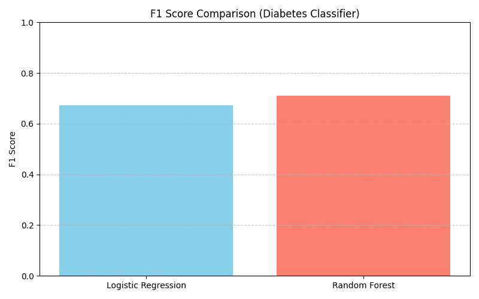

# 🩺 Diabetes Prediction Classifier

This project builds and compares machine learning models to predict whether a patient is diabetic based on basic health metrics. It uses the well-known **Pima Indians Diabetes Dataset** for training and evaluation.

---

## 🔍 Goal

To evaluate and compare the performance of two classification models:
- **Logistic Regression**
- **Random Forest**

The comparison focuses on how well each model predicts the **diabetic class (Outcome = 1)**, using metrics like **precision, recall, and F1-score**.

---

## 📦 Dataset

- **Source**: [Pima Indians Diabetes Dataset](https://www.kaggle.com/datasets/uciml/pima-indians-diabetes-database)
- **Samples**: 768 female patients of Pima Indian heritage
- **Features**:
  - Pregnancies
  - Glucose
  - BloodPressure
  - BMI
  - DiabetesPedigreeFunction
  - Age
- **Label**: `Outcome` (0 = not diabetic, 1 = diabetic)

---

## ⚙️ Workflow

1. **Data Cleaning**
   - Dropped low-signal features (`Insulin`, `SkinThickness`)

2. **Feature Scaling**
   - Standardized all features using `StandardScaler` to normalize input

3. **Model Training**
   - Used `train_test_split` with 80/20 ratio
   - Trained and evaluated:
     - Logistic Regression (`class_weight='balanced'`)
     - Random Forest (`class_weight='balanced'`, `max_depth=4`, `n_estimators=200`)

4. **Model Evaluation**
   - Metrics printed:
     - Confusion Matrix
     - Classification Report (Precision, Recall, F1)
   - Comparison plotted using F1-score

---

## 📈 Results

| Model               | F1 Score (Diabetic Class) |
|---------------------|---------------------------|
| Logistic Regression | ~0.67                     |
| Random Forest       | ~0.71 ✅                  |

📌 Random Forest slightly outperformed logistic regression, especially in **recall** for detecting diabetic patients.

---

## 📊 Visualization

The script ends with a **bar chart** showing the F1-scores for both models:



---

## 🧠 Key Takeaways

- Logistic Regression is easy to interpret and a strong baseline.
- Random Forest (with tuning) improved recall for the diabetic class without overfitting.
- The dataset is small, so results are best treated as a **prototype** — not medically actionable.

---

## ▶️ Running the Project

### Install dependencies:
```bash
pip install pandas scikit-learn matplotlib
```

### Run classifier
```bash
py diabetes_predictor.py
```